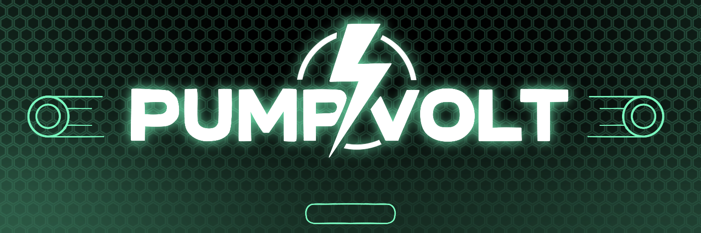

# app.PumpVolt.fun Demo – Open Source Repository

Welcome to the **PumpVolt.Fun Demo** repository. This demo release is intended to provide **legitimacy and transparency** to our investors and stakeholders, showcasing a portion of the technology and processes behind our application. Please note that **this is only a demo** version, and the **complete, production-level source code is not publicly available**. The full application—exclusively provided to verified holders—offers significantly more robust features, security, and functionality.

---

## Overview

This application is a **Flask**-based web platform that integrates **Pump.fun** bundler operations, leverages advanced AI tools, and facilitates **automated pump transactions**. It demonstrates our commitment to delivering cutting-edge functionality, user-friendly interfaces, and advanced automation features.

### Key Modules and Features

1. **Pump.fun Bundler Integration**  
   - Comprehensive interface and bundler management system  
   - Automated pump transaction orchestration  

2. **AI-Driven Operation Panel**  
   - Integrated AI chat system for Pump.fun bundler operations  
   - AI-assisted bundle optimization and strategic recommendations  

3. **Wallet and Funding Management**  
   - Secure wallet management functions  
   - Automated wallet funding features  

4. **System Architecture**  
   - **Dynamic Dashboard**: Provides real-time data and management tools  
   - **Advanced Bundler Management**: Streamlined bundling operations with configurable options  
   - **Configurable Settings Interface**: Allows quick adjustments to system preferences  

---

## Repository Contents

```
opensourcedemo/
│
├── static/
│   └── css/                # Stylesheets
│
├── templates/              # HTML templates for Flask
│
├── README.md               # This file
├── app.py                  # Main Flask application entry point
├── coin_data.py            # Coin data handling and retrieval
├── crypto_operations.py    # Core crypto transaction and operation logic
├── error_log.txt           # Error logging and monitoring
├── gpt_integration.py      # AI integration module
├── pumpfun.py              # Custom Pump.fun helper module
├── pumpfun_integration.py  # Pump.fun bundler integration logic
├── requirements.txt        # Python dependencies
├── solana_interaction.py   # Solana-related functions and integration
├── utils.py                # Utility functions
├── wallet_management.py    # Secure wallet management functions
└── wallets.json            # Example wallet configuration file
```

---

## Getting Started

1. **Clone the Repository**  
   ```bash
   git clone https://github.com/YourUserName/opensourcedemo.git
   cd opensourcedemo
   ```

2. **Install Dependencies**  
   ```bash
   pip install -r requirements.txt
   ```

3. **Run the Application**  
   ```bash
   python app.py
   ```
   Access the web interface at [http://127.0.0.1:5000/](http://127.0.0.1:5000/).

---

## Important Note on the Production Version

While this repository provides a glimpse into our architecture and approach, it does **not** represent the **full** PumpVolt.Fun application. The **full version is exclusive to verified holders** and includes advanced security measures, proprietary algorithms, and additional functionalities. This demo aims to maintain **investor confidence** by offering transparency into our development process, without revealing the complete proprietary system.

---
